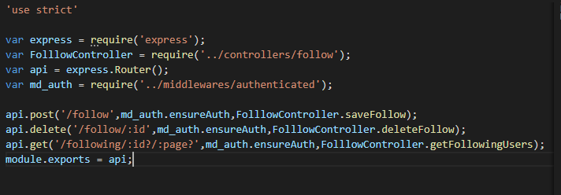

# Preparación del entorno de desarrollo
## 24-03-2020

- Descargar e instalar Cygwin (Terminal en windows que funciona con comandos de linux).
- Descargar e instalar MongoDb la que será nuestra base de datos en el proyecto.
- Descargar e instalar Robo 3T, un administrador visual de MongoDb.
- Instalar Node.js
- Instalar DIA para hacer un diagrama del diseño de nuestra base de datos
- Instalar Postman para hacer peticiones.

## 25-03-2020

 Crear un proyecto de node js con el comando
 
        npm -init

 Creamos una carpeta llamada api en la que meteremos el archivo package.json que se nos ha generado.

 Dentro de la carpeta api empezaremos a instalar dependencias y librerias que necesitamos en el proyecto

Instalamos Bcrypt para la encriptación de contraseñas de una manera sencilla

        npm install bcrypt --save

Intalamos body-parser para convertir nuestras peticiones a objetos usables por javascript

        npm install body-parser --save

Intalamos connect-multiparty para la subida de ficheros

        npm install connect-multiparty --save

Instalamos Express que es el framework http que nos generara las rutas 

        npm install express --save

Instalamos jwt-simple nos va a servir para gestionar tokens e identificación
    
    npm install jwt-simple --save

Instalamos moment para la generar de fechas y timestamp
    
    npm install moment --save

Instalamos mongoose que es el ORM de mongoDB para trabajar con Node.js  
    
    npm install mongoose --save

Instalamos nodemon para refrescar el servidor cada vez que hagamos algun cambio en el codigo fuente.

    npm install nodemon --save-dev (para usar esta dependencia solo en el desarrollo o local)

Instalamos mongoose-pagination para poder paginar los usuarios de nuestra base de datos

    npm install --save mongoose-pagination
# Instalamos moment pero en ANGULAR (!IMPORTANT) para poder gestionar las fechas

    npm install moment --save

# Creación de la base de datos

Primero arrancamos el mongodb.exe para la ejecucion de la base de datos en segundo plano, luego usando el programita Robo 3T crearemos una nueva base de datos en nuestra conexion local con el nombre de curso_mean_social

## 26-03-2020

# Conexion a la base de datos

Creamos un index.js en la carpeta de API con las siguientes lineas.

Y con la instruccion siguiente lo arrancamos.

    
        node index.js

Si nos da algun problema al arrancarlo uno de los mas comunes puede que sea que no tengamos mongod.exe en segundo plano

Luego de ver que funciona añadiremos un script al package.json para no tener que parar y arrancar la conexion a la base de datos cada vez que hagamos un cambio

        "start" : "nodemon index.js"

## 27-03-2020

# Creacion de los modelos a usar en el backend

Creamos una carpeta de models dentro de la carpeta api 

Dentro vamos creando los diferentes modelos con las siguientes caracteristicas:

# Creacion de los controladores a usar en el backend

Creamos una carpeta de controllers dentro de la carpeta api 

Dentro vamos creando los diferentes controladores con las siguientes caracteristicas:

*Explicacion*

Primero de todo tenemos que cargar en una variable el modelo y a partir de ahí ya creamos las diferentes funciones a realizar.

# Creacion de las rutas a usar en el backend

*Explicacion*

Primero de todo tenemos que cargar en una variable express para poder usar el router luego cargamos el controlador y a partir de ahí inicializamos la en una variable el router de express.

Al final debemos siempre exportar los el router de express pa poder utilizarlo en app.js.

## 28-03-2020

*DIA DE DESCANSO*

## 29-03-2020

# Registro de usuarios en Node.js y MongoDB

Creamos una funcion llamada saveUser que a la que le pasaremos una request y una response. Guardaremos la peticion(req) en una variable y llenaremos los campos para que coincidan con los de nuestro modelo.

Primero antes de enviar los datos de registro tenemos que comprobar que el email o el nick no esten registrados ya.

Para ello utilizaremos la funcion User.find() y la compararemos con los datos recibidos por post.

Despues de esto tenemos que hacer exportar el metodo y crear una ruta en  *routes/user.js*  para poder probarlo en Postman y ver que funciona bien.

        api.post('/register',UserController.saveUser);

# Login de usuarios

Vamos a hacer ahora el login de usuarios, para ello creamos un metodo llamado loginUser que tendrá a su vez dos parametros como siempre la peticion(req) y la respuesta (res).

Ahora lo que hacemos es ver si el email del usuario existe y si existe compararlo con la contraseña que nosotros hemos enviado por post con la que tiene ese email. Si coicide nos devolvera el usuario y sino nos indicara el error en la foto.

Hecho esto hacemos como en anteriores metodos y exportamos la funcion y creamos una ruta para ello.

    api.post('/login',UserController.loginUser);

Igualmente lo podemos probar en el Postman.

# 30-03-2020

## Servicio y tokens JWT

Esto nos servirá para guardar los datos codificados en un token.

Primero de todo crearemos una carpeta llamada servicios y dentro un arhcivo llamado *jwt.js* con los siguientes datos.

*Explicacion*

Tenemos que cargar dos variables para poder usar jwt(creacion de tokens) y moment (para controld de fechas)

Luego creamos la funcion a exportar con los datos del modelo de usuarios ademas de las siguientes propiedades
- La propiedad *sub* seria el identificador del token en jwt.
- La propiedad *iat* seria la encargada de decirnos cuando se ha creado el token
- La propiedad *exp* seria la encargada de decirnos el tiempo de expiación del token.

Y tambien le pasamos la variable secret que es una password que solo conocemos nostros como programadores del backend.

Una vez creado el servicio tenemos que importarlo en el controlador para poder usarlo.

Podriamos probarlo en el postman para ver si funciona, para ello tenemos que pasarle una propiedad que seria getToken con el valor true y la petición nos devolvería un hash con toda la información del objeto.

## Middlewares de autentificación

Es un metodo que se va ejecutar antes de la funcion del controlador que nuestra api. Lo que va hacer es una comprobacion para ver si el token es valido y en caso de que sea dejar acceder o hacer cualquier peticion que pida el usuario en caso contrario nos dira que ha habido algun error en la comprobación del token.

Nos creamos una carpeta llamada middlewares y en ella creamos un archivo con los siguientes datos:

*Explicacion*

Primero tenemos que comprobar que la cabezera lleva la autentificacion necesaria y si es asi ya guardamos el token en una variable.

Una vez tengamos esto debes descodificar el token con el metodo decode que nos pedira el mismo token y la clave secreta que hemos utilizado anteriormente para codificar.

Es recomendable utilizar el payload dentro de un try catch debido a que es sensible a errores.

Una vez hecho esto debemos volver al archivo de las rutas para cargar en middleware en una variable y poder utilizarla en alguna de nuestras rutas

    var md_auth = require('../middlewares/authenticated');

    api.get('/pruebas',md_auth.ensureAuth, UserController.pruebas);

En el postman en la parte de *Headers* tenemos que pasarle un parametro llamado Authorization y el valor seria el de nuestro token.

# 31-03-2020

# Devolver los datos del usuario

Para conseguir los datos del usuario tenemos que hacer una funcion muy sencilla

Para probarlo creamos la funcion en las rutas 
    
    api.get('/user/:id',md_auth.ensureAuth, UserController.getUser);

En el postamn le pasamos el ide por la URL y podemos comprobar que funciona.

# 01-04-2020

## Paginar Usuarios

Vamos a hacer ahora un metodo para paginar todos los usuarios de nuestra red social.

*Explicacion*

Tenemos el id del usuario guardado en la propiedad sub asi que podemos ir sacandolos. Luego tenemos que devolver una funcion callback del User.find.sort

## Actualizar datos de usuario

Vamos a crear la funcion para poder actualizar los datos de los usuarios. Lo que tenemos que tener en cuenta aqui es no actualizar la contraseña ya que es el dato mas delicado. Con *delete* conseguimos esto

Luego tenemos que crear la ruta para poder actualizar que en este caso tiene que ser put:

    api.put('/update-user/:id',md_auth.ensureAuth,UserController.updateUser);

Si quisieramos probarlo en el Postman primero deberiamos hacer una peticion de login para conseguir el token y ya luego pasar los datos como tocan.

# 02-04-2020

*DIA DE DESCANSO*

# 03-04-2020

## Subir avatar de usuario

Pasamos ahora a subir un avatar en nuestro perfil de usuario. Lo primero que tenemos que hacer es vigilar que el usuario que esta logueado es quien dice ser. Luego de esta pequeña comprobacion tenemos que guardar el path del archivo a subir en variables. 

*Explicacion*

- Las la primera variable nos recoje toda la ruta del archivo donde se va a guardar, en el controlador veremos como guardar utilizando la libreria multipart.

- La en la segunda variable cortariamos el nombre del archivo subido (uploads/users/foto.png).

- En la tercera nos quedariamos solamente con el nombre del archivo que es lo que realmente queremos. 

- Y en la ultima separariamos el la extension en una variable aparte para hacer las siguientes comprobaciones para saber que se trata de una imagen.

Una vez hecho esto importamos multipart y creamos un middleware para poder subir archivos en node.js y luego creamos la ruta  para poder probarlo:

    var multipart = require('connect-multiparty');
    var md_upload = multipart({ uploadDir: './uploads/users' });

    *Ruta*

    api.post('/upload-image-user/:id', [md_auth.ensureAuth,md_upload], UserController.uploadImage);

Como vemos en la imagen superior para poder pasar mas de un middleware tenemos que pasarlo como una coleccion.

## Recibir el avatar de un usuario

Para recibir el avatar de un usuario vamos a hacer lo siguiente

*Explicacion*

Recibiremos los datos por la URL y la concatenaremos con nuestro el nombre de la imagen para comprobar que existe. Luego solo tenemos que hacer una comprobacion y lo tendriamos, creamos la ruta por GET para probarlo en POSTMAN

    api.get('/get-image-user/:imageFile', UserController.getImageFile);

# 04-4-2020

## Controlador de seguimiento

Este controlador de follows nos va a permitir seguir a usuarios seguirse y dejar de seguirse asi como ver listados de quien nos sigue y a quien seguimos

Creamos el controlador de follows y las routas de follows igual que hemos hecho con usuarios.js

*follow routes*

En app.js tenemos que cargar el controlador para poder usar la rutas

Luego podemos ir creando los diferentes metodos que nos haran falta en el controlador.

## Seguir a un usuario

Vamos a crear un metodo para que un usuario permita seguir a otro:

Luego lo que tenemos que hacer es crear la ruta para probarlo

    api.post('/follow',md_auth.ensureAuth,FolllowController.saveFollow);

Le pasariamos el middlewere de autentificacion para saber quienes somos y por parametro a quien queremos seguir.

En la base de datos se nos quedaria asi guardada la coleccion:

- En *azul* podemos ver que es el mismo usuario el que sigue a los *rojos* que serian dos usuarios distintos

# 05-04-2020

## Dejar de seguir

Vamos a crear el metodo para dejar de seguir a usuarios.

*Explicacion*

Lo unico que hacemos es ver el usuario que somos nosotros y ver si existe el follow para dejar de seguirlo (en este caso borrar el seguimiento de la base de datos).

Y su respectiva ruta que en este caso es un DELETE:

    api.delete('/follow/:id',md_auth.ensureAuth,FolllowController.deleteFollow);

## Listado de usuarios que sigo 

Necesitamos un listado paginado de los usuarios que nos siguen para eso creamos el siguiente metodo:

Solo necesitamos el usuario del cual queramos sacar a los seguidores y una vez lo tengamos hacemos el populate (que seria como un join en bases de datos sql) y luego lo paginamos.

Luego creamos la ruta.

    api.get('/following/:id?/:page?',md_auth.ensureAuth,FolllowController.getFollowingUsers);

El resultado seria este en el postman.

Podemos ver que este usuario siguie a dos usuarios y lo ha paginado todo en una misma pagina.

